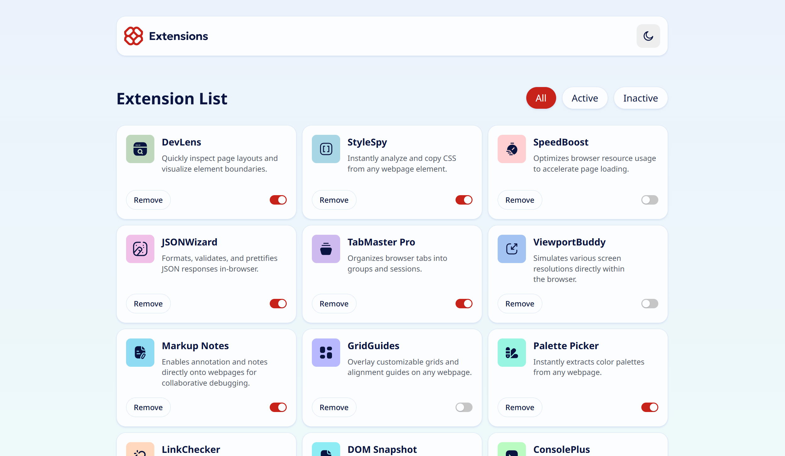

# Frontend Mentor - Browser extensions manager UI solution

This is a solution to the [Browser extensions manager UI challenge on Frontend Mentor](https://www.frontendmentor.io/challenges/browser-extension-manager-ui-yNZnOfsMAp). Frontend Mentor challenges help you improve your coding skills by building realistic projects.

## Table of contents

- [Overview](#overview)
  - [The challenge](#the-challenge)
  - [Screenshot](#screenshot)
  - [Links](#links)
- [Author](#author)

## Overview

### The challenge

Users should be able to:

- Toggle extensions between active and inactive states
- Filter active and inactive extensions
- Remove extensions from the list
- Select their color theme
- View the optimal layout for the interface depending on their device's screen size
- See hover and focus states for all interactive elements on the page

### Screenshot

### Links

- Solution URL: [https://www.frontendmentor.io/solutions/browser-extension-manager-using-react-vite-and-css-modules-72J2rcfpKD](https://www.frontendmentor.io/solutions/browser-extension-manager-using-react-vite-and-css-modules-72J2rcfpKD)
- Live Site URL: [(https://gl-browser-extension-manager.netlify.app/](https://gl-browser-extension-manager.netlify.app/)

## Author

- Website - [Guillaume Lorel](https://guillaumelorel.com/)
- Frontend Mentor - [@GuillaumeLorel](https://www.frontendmentor.io/profile/GuillaumeLorel)
- Linkedin - [@guillaumelorel](https://www.linkedin.com/in/guillaumelorel/)
