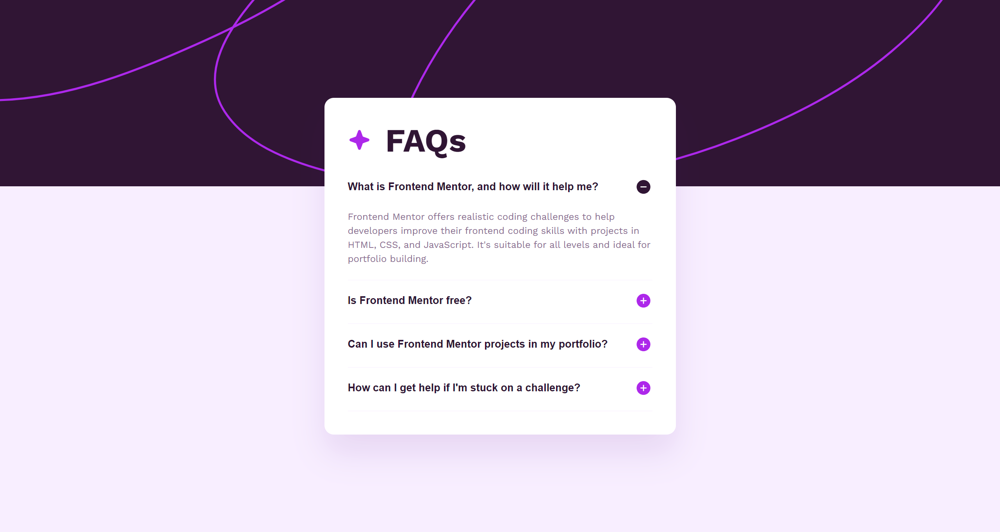

# Frontend Mentor - FAQ accordion solution

This is a solution to the [FAQ accordion challenge on Frontend Mentor](https://www.frontendmentor.io/challenges/faq-accordion-wyfFdeBwBz). Frontend Mentor challenges help you improve your coding skills by building realistic projects.

## Table of contents

- [Overview](#overview)
  - [The challenge](#the-challenge)
  - [Screenshot](#screenshot)
  - [Links](#links)
- [Author](#author)

**Note: Delete this note and update the table of contents based on what sections you keep.**

## Overview

### The challenge

Users should be able to:

- Hide/Show the answer to a question when the question is clicked
- Navigate the questions and hide/show answers using keyboard navigation alone
- View the optimal layout for the interface depending on their device's screen size
- See hover and focus states for all interactive elements on the page

### Screenshot

### Links

- Solution URL: [https://www.frontendmentor.io/solutions/faq-accordion-x_v9o-7Iwk](https://www.frontendmentor.io/solutions/faq-accordion-x_v9o-7Iwk)
- Live Site URL: [(https://gl-faq-accordion.vercel.app/](https://gl-faq-accordion.vercel.app/)

## Author

- Website - [Guillaume Lorel](https://guillaumelorel.com/)
- Frontend Mentor - [@GuillaumeLorel](https://www.frontendmentor.io/profile/GuillaumeLorel)
- Linkedin - [@guillaumelorel](https://www.linkedin.com/in/guillaumelorel/)
